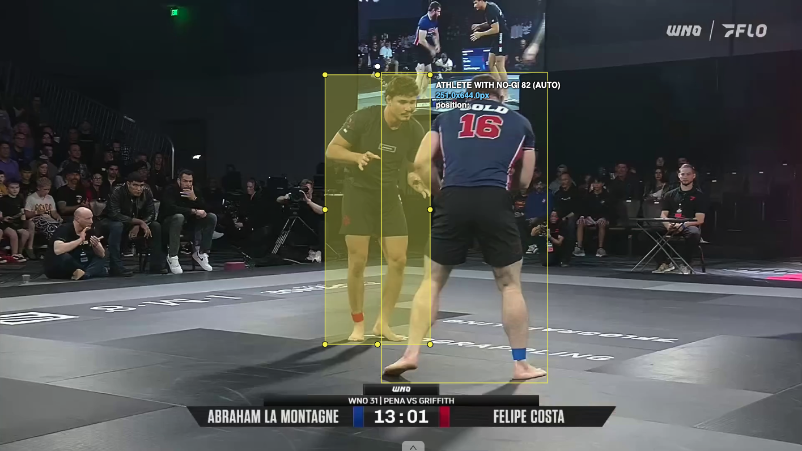
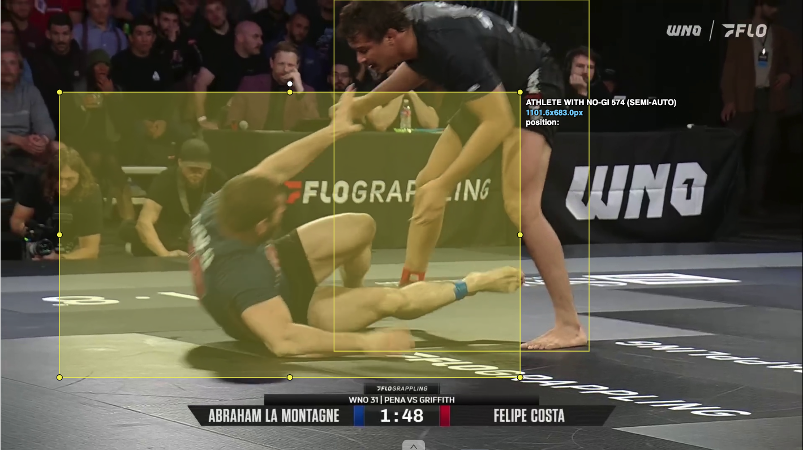
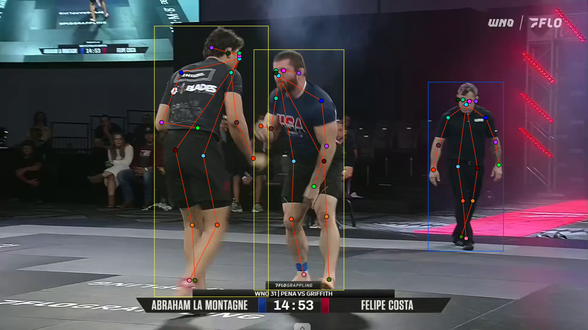
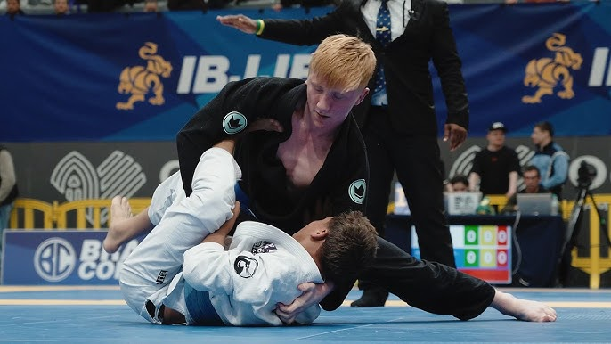
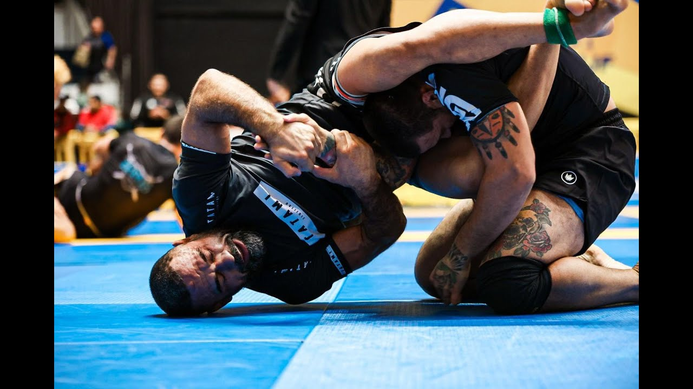
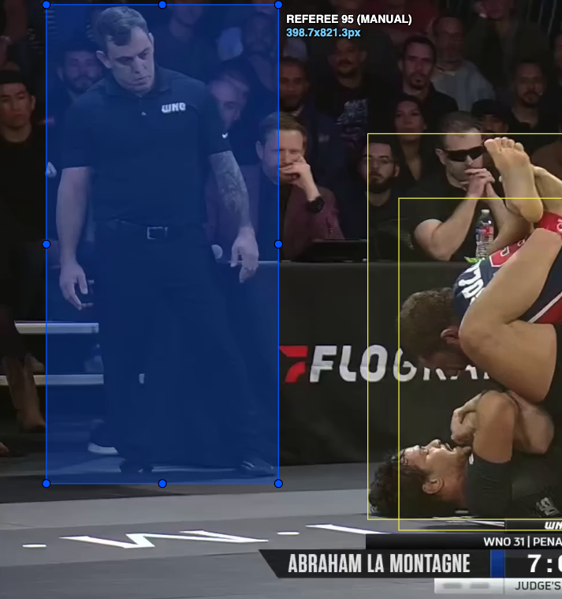
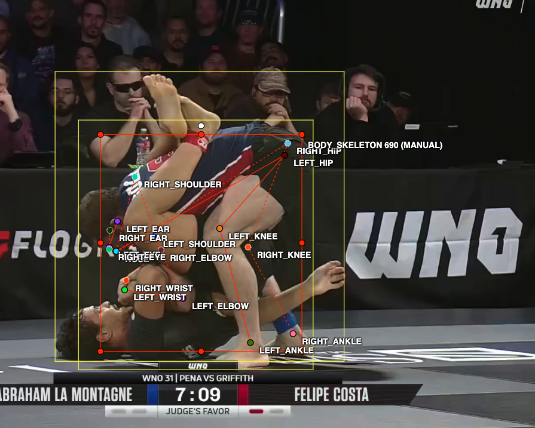
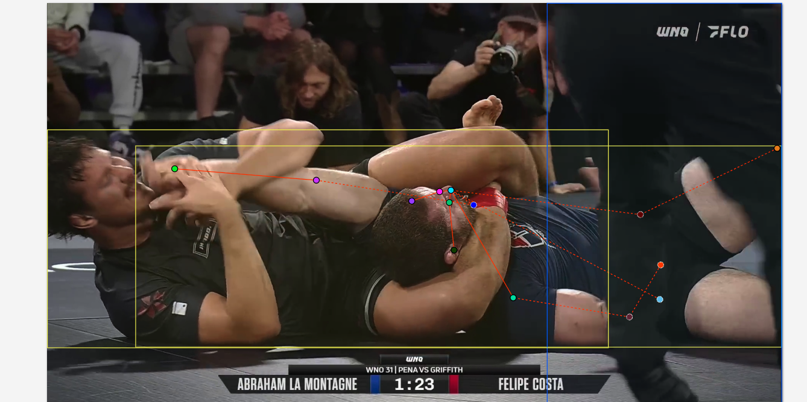

# BJJ Match Image Annotation Instructions

## Project Overview
You will be annotating images from Brazilian Jiu-Jitsu (BJJ) matches to help train computer vision models for athlete detection and match analysis.

## For Upwork Contractors & Outsourced Annotators
- **This document** is your main reference. Please read it fully before starting and keep it open while you work.
- **No BJJ experience needed.** Follow the class definitions and examples; the instructions are self-contained.
- **Deliverables:** Annotations are done directly in CVAT. You do not export or send files—we review and export from the server. Your job is to complete the assigned tasks in CVAT with high quality.
- **Onboarding:** You will receive CVAT login credentials and a link to this document. You may be asked to complete a small test batch (e.g. 10–20 images) for QA before full batch work.
- **Communication:** Use the contact email in "Getting Help" for annotation questions, access issues, or unclear instructions. For project scope or payment, use the channel agreed in your contract (e.g. Upwork messages).
- **Before you start:** (1) Receive CVAT login and this document. (2) Read this document once. (3) Log in to CVAT and complete any test batch if requested. (4) Then proceed with assigned tasks.

## Annotation platform (CVAT)
Annotations are done in **CVAT**. External annotators (e.g. Upwork contractors) connect at:

- **URL:** [https://cvat.bjj-vision.com](https://cvat.bjj-vision.com)
- **Login:** Use the username and password provided to you. Do not share these credentials.

This instance supports marking keypoints as **occluded** (position known but not visible) and using **dotted lines** (dots link) for occluded connections, as described in the keypoint section below.

### CVAT workflow (quick reference)
- **Tasks / Jobs:** You will be assigned a task (or multiple jobs). Open the task and work through the frame list. Save your work regularly (Ctrl/Cmd + S).
- **Bounding boxes:** Use the **Rectangle** tool. Choose the correct label: `athlete with gi`, `athlete with no gi`, or `referee`. Draw one box per person.
- **Keypoints (skeleton):** Use the **Skeleton** or **Keypoints** tool with the project’s 17-point skeleton template. Place points in order (nose → eyes → ears → shoulders → elbows → wrists → hips → knees → ankles). Mark points as **occluded** when the joint is hidden; use **dotted links** for connections where at least one endpoint is occluded.
- **Navigation:** Use the frame strip or Next/Previous to move between images. Complete all boxes for an image before moving to keypoints, then move to the next image.
- **No export needed:** Annotations stay in CVAT; we will review and export them on our side.

## What You'll Annotate
Each image contains 2-3 people:
- **2 athletes** (competitors in BJJ match)
- **1 referee** (person in different uniform, usually standing)

## Annotation Tasks

### Stage 1: Bounding Boxes
Draw rectangular boxes around each person in the image.

**Steps:**
1. Identify all people in the image (typically 2 athletes + 1 referee)
2. For each person, draw a tight bounding box that:
   - Includes their entire body (head to feet)
   - Includes any limbs that are visible
   - Has minimal empty space around the person
3. Label each box as either:
   - **`athlete with gi`** - competitors wearing gi (traditional uniform)
   - **`athlete with no gi`** - competitors wearing no-gi attire (rash guard, shorts)
   - **`referee`** - official wearing different uniform (usually black/white striped or solid colored shirt)

**Quality Guidelines:**
- ✅ **DO:** Make boxes as tight as possible around the person
- ✅ **DO:** Include all visible body parts
- ✅ **DO:** Include the person even if partially occluded (blocked by another person)
- ❌ **DON'T:** Leave large gaps between the box edge and the person
- ❌ **DON'T:** Cut off any visible body parts
- ❌ **DON'T:** Skip people who are partially out of frame (annotate visible portion)

**Examples:**
Good box:

```
┌──────────┐
│ Athlete  │  ← Tight fit
│  Person  │  ← All limbs included
│    🧍    │  
└──────────┘
```
Bad box:


```
┌────────────────┐
│                │  ← Too much empty space
│      🧍        │
│                │
└────────────────┘
```

---

### Stage 2: Pose Keypoints
Mark 17 body keypoints for each person (after bounding boxes are complete).

**Keypoint List:**
Standard COCO pose format - 17 points per person:

1. **Nose**
2. **Left Eye**
3. **Right Eye**
4. **Left Ear**
5. **Right Ear**
6. **Left Shoulder**
7. **Right Shoulder**
8. **Left Elbow**
9. **Right Elbow**
10. **Left Wrist**
11. **Right Wrist**
12. **Left Hip**
13. **Right Hip**
14. **Left Knee**
15. **Right Knee**
16. **Left Ankle**
17. **Right Ankle**

**How to Mark Keypoints:**
1. Click on the exact location of each body joint/landmark
2. If a keypoint is **not visible** (occluded, out of frame, or obscured):
   - **If your tool supports an "occluded" or visibility flag** (e.g. CVAT): you can place the keypoint where you believe it is and mark it as occluded—meaning "position known but not visible."
   - **If your tool does not support that**: do **not** place the keypoint; leave it unplaced/skipped. Do NOT guess positions for invisible keypoints.
3. "Left" and "Right" refer to the person's left/right (not your perspective)
4. **Line style for occlusion (if supported by your tool):** When the connection between two keypoints is drawn as a **dotted line** (or "dots link"), it means that **at least one of the keypoints connected by that line is occluded** (hidden by another person, limb, or object). Use solid lines only when both keypoints and the limb between them are clearly visible. If your tool has no dotted-line option, follow the visibility rules above instead.

**Example:**


**Quality Guidelines:**
- ✅ **DO:** Place points precisely on the center of each joint
- ✅ **DO:** Mark all visible keypoints
- ✅ **DO:** If the tool allows it, mark keypoints as "occluded" when blocked (position known but not visible) and use **dotted lines** (dots link) for occluded connections; otherwise only place keypoints you can see
- ❌ **DON'T:** Guess positions for invisible keypoints (never place a keypoint you cannot see unless the tool explicitly supports "occluded" and you mark it as such)
- ❌ **DON'T:** Mix up left/right (always use the person's perspective)
- ❌ **DON'T:** Skip keypoints that are visible
- ❌ **DON'T:** Use solid lines for occluded connections if your tool supports dotted lines—use dotted lines (dots link) instead

**Special Cases:**

**Grappling (people tangled):**
- Athletes in BJJ are often entangled
- Mark what you can see clearly
- Mark occluded keypoints as "not visible"
- Take your time to trace each person's body

**Ground positions:**
- Athletes may be lying down, sideways, or upside-down
- Keypoints still follow the same body landmarks
- Use the person's anatomical orientation (their left is their left, regardless of how they're rotated)

**Referee:**
- Referees are usually standing upright
- Annotate them the same way as athletes
- All 17 keypoints apply

---

## Class Definitions

### `athlete with gi`
**Who:** Competitors wearing traditional BJJ uniform
**Appearance:**
- Wearing **gi** (traditional white, blue, or black kimono-style uniform)
- Usually on the ground or engaged with another athlete
- May have colored belts visible

**Example image:**


**Examples:**
- Person in white gi rolling on the mat
- Person in blue gi standing/fighting

### `athlete with no gi`
**Who:** Competitors wearing no-gi attire
**Appearance:**
- Wearing **rash guard**, **shorts**, or **spats**
- Usually on the ground or engaged with another athlete
- No loose fabric to grab

**Example image:**


**Examples:**
- Person in rash guard and shorts grappling

### `referee`
**Who:** Official overseeing the match
**Appearance:**
- Usually wearing **different uniform** than athletes:
  - Black and white striped shirt (like soccer referee)
  - Solid black or blue shirt
  - Sometimes formal attire (button-up shirt)
- Usually **standing** or **kneeling** next to athletes
- Not actively grappling
- May be gesturing or observing closely

**Example image:**


**Examples:**
- Person in striped shirt standing over match
- Person in black shirt kneeling beside athletes
- Person in formal attire watching the match

---

## Common Mistakes to Avoid

### Mistake 1: Wrong Class Label
❌ **Wrong:** Labeling a referee as `athlete with gi` or `athlete with no gi` because they're on the mat
✅ **Correct:** Check the uniform - referees wear different clothing

### Mistake 2: Loose Bounding Boxes
❌ **Wrong:** Box with 20-30% empty space around person
✅ **Correct:** Tight box with 5-10% padding max

### Mistake 3: Missing Partial People
❌ **Wrong:** Skipping a person whose arm is out of frame
✅ **Correct:** Annotate the visible portion

### Mistake 4: Guessing Occluded Keypoints
❌ **Wrong:** Placing a wrist keypoint where you think it "should be" but can't see
✅ **Correct:** Mark as "not visible" or "occluded"

### Mistake 5: Left/Right Confusion
❌ **Wrong:** Using your left/right perspective
✅ **Correct:** Using the person's anatomical left/right (imagine you are them)

---

## Quality Checklist

Before submitting each image, verify:

**Bounding Boxes:**
- [ ] All athletes (2) have a box
- [ ] The referee has a box if visible in the image
- [ ] Boxes are tight (minimal empty space)
- [ ] All visible body parts are included
- [ ] Each box has correct label (`athlete with gi`, `athlete with no gi`, or `referee`)

**Keypoints:**
- [ ] All visible keypoints are marked for each person
- [ ] Occluded keypoints are marked as "not visible" or left unplaced (if the tool has no occluded option); occluded connections use **dotted lines** (dots link) if supported
- [ ] Left/right keypoints match the person's anatomical orientation
- [ ] Keypoints are placed precisely on joints (not approximate)

---

## Examples

### Example 1: Two Athletes Ground Fighting (No-Gi)



Two athletes in no-gi attire (rash guards and shorts) grappling on the ground. Draw **one bounding box per person** (tight, head to feet). Mark keypoints for each (in order to be clear in the picture we only mark keypoints for one athletes. In practice one should mark keypoints for both athletes)

- **Bounding boxes:** Box 1: `athlete with no gi` (person on top). Box 2: `athlete with no gi` (person on bottom).
- **Keypoints:** Place all 17 keypoints where visible. Use solid lines between visible keypoints; use **dotted lines** for connections where either keypoint or the limb is occluded (e.g., legs/arms behind the other person).

---

### Example 2: Standing Match with Referee


Two athletes in no-gi standing and a referee to the side. Each person has a tight bounding box and full pose keypoints. Referee has a distinct uniform (e.g., black shirt); athletes have rash guards/shorts.

- **Bounding boxes:** Box 1: `athlete with no gi`. Box 2: `athlete with no gi`. Box 3: `referee`.
- **Keypoints:** All three people get 17 keypoints. Use **dotted lines** (dots link) for any connection where a keypoint is occluded; solid lines where both keypoints and the limb are visible.

---

### Example 3: Submission / Complex Ground Position



Two athletes in no-gi in a submission or tight control position; bodies are twisted and many limbs are hidden. Draw one box per athlete. Keypoint visibility is limited—mark only what you can see and use **dotted lines** for occluded connections.

- **Bounding boxes:** Box 1: `athlete with no gi` (e.g., top position). Box 2: `athlete with no gi` (e.g., bottom position).
- **Keypoints:** Mark every visible keypoint. For any link where a keypoint (or the limb between two keypoints) is blocked by the other athlete or body, draw a **dotted line** (dots link) to indicate occlusion.

---

## Getting Help

**If you're unsure about:**
- **Class label:** Look at the uniform - different from athletes (gi or no-gi) = referee
- **Occluded keypoint:** When in doubt, mark as "not visible" if the tool allows it; otherwise leave the keypoint unplaced and do not guess
- **Anatomical left/right:** Imagine you are that person, which is YOUR left arm?
- **Bounding box size:** Err on the side of slightly larger rather than cutting off body parts

**Contact (annotation questions, CVAT access, or unclear instructions):** stant.x.l.18@gmail.com or slack channel for your project.
For payment or contract terms, use the channel agreed in your Upwork contract.

---

## Time Estimates

Based on typical annotation speed:

**Bounding boxes only:**
- Simple image (2-3 people, clear view): 30-60 seconds
- Complex image (tangled, partially occluded): 60-90 seconds

**Keypoints only (after boxes done):**
- Simple image (all keypoints visible): 2-3 minutes per person
- Complex image (many occlusions): 3-5 minutes per person

**Total per image (boxes + keypoints):**
- Simple: ~5-7 minutes
- Complex: ~8-12 minutes

---

## Payment & Progress (Outsourced / Upwork)

- **Batch size:** Images are assigned in batches (e.g. 100–500 per task). Complete all images in a task before requesting the next batch (unless otherwise agreed).
- **QA process:** We review a random sample (typically 10–20%) of each batch. If quality is good, the batch is accepted and you may receive the next batch. Payment is processed per the terms in your contract (e.g. after batch acceptance or milestone).
- **Revisions:** If QA finds issues, we may return a list of frames to fix (e.g. missing person, wrong label, loose box, keypoint errors). Please correct those in CVAT and tell us when done. Repeated or severe quality issues may result in batch rejection or contract review.
- **Rejection criteria (what we check for):**
  - Missing people in the image (all 2 athletes + referee if visible must have a box)
  - Wrong class labels (`athlete with gi` / `athlete with no gi` / `referee`)
  - Sloppy bounding boxes (too loose or cutting off body parts)
  - Incorrect or guessed keypoints (or missing occluded marking / dotted lines where required)

**Tip for success:** Take your time on the first 10–20 images to build accuracy; then speed will come naturally.

---

**Thank you for your careful work! Your annotations will help create AI that can automatically analyze BJJ matches and help athletes improve their technique.**
